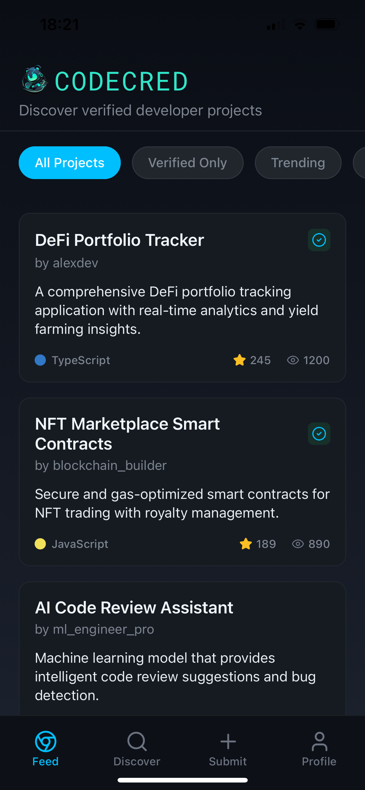
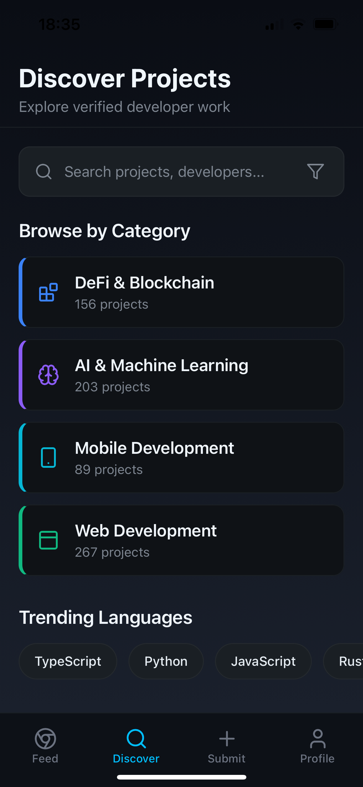
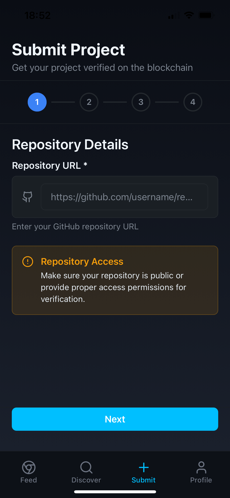
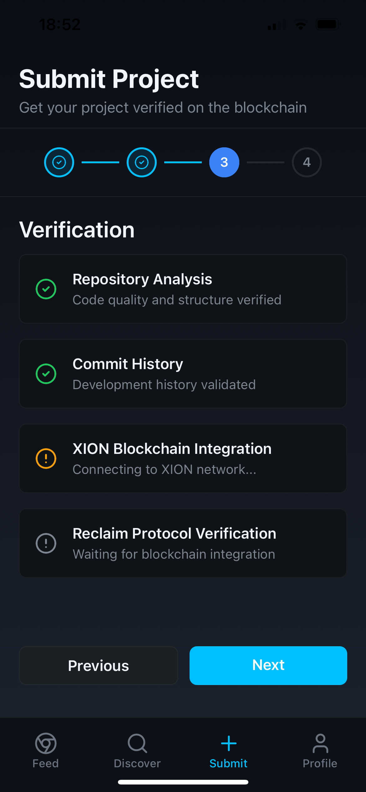

#  CodeCred Mobile App

A professional mobile application built with React Native and Expo, designed to showcase and verify developer credentials through blockchain technology. The app features a clean, GitHub-inspired interface for discovering, submitting, and verifying code repositories.

## 🎯 Project Goals

CodeCred aims to create a comprehensive platform where developers can:

- **Showcase verified projects** with blockchain-backed credentials
- **Discover quality repositories** through a curated feed
- **Submit projects for verification** with an intuitive multi-step flow
- **Build trusted developer profiles** with verifiable achievements

## 🚀 Features

### Core Functionality
- **Profile Management**: Clean user profiles with stats, verified projects, and professional presentation
- **Discovery Feed**: Search and filter through verified projects with advanced discovery tools
- **Project Submission**: Multi-step verification flow for repository submissions
- **Project Details**: Comprehensive project views with metrics, language distribution, and README display
- **Verification System**: Blockchain-based project verification and credentialing

### Design & UX
- **GitHub-Inspired UI**: Professional, clean interface mimicking GitHub's mobile design
- **Dark Theme**: Elegant dark mode with sophisticated color palette
- **Responsive Design**: Optimized for various mobile screen sizes
- **Smooth Animations**: Polished micro-interactions and transitions
- **Modern Navigation**: Bottom tab navigation with intuitive user flows

### Key Technologies
- **XION Blockchain Integration**: Secure credential storage and verification
- **Reclaim Protocol**: Privacy-preserving data verification
- **Automated Verification**: Smart contract-based project validation
- **Community Features**: Upvoting and social interaction system

## 🛠️ Tech Stack

- **Framework**: React Native with Expo SDK
- **Navigation**: Expo Router
- **Styling**: NativeWind (Tailwind CSS for React Native)
- **Blockchain**: XION MDK
- **Protocol**: Reclaim Protocol
- **State Management**: React Context/Hooks
- **UI Components**: Custom components with Lucide React Native icons

## 📱 Screenshots






## 🚦 Getting Started

### Prerequisites

- Node.js (v18 or later)
- npm or yarn
- Expo CLI
- iOS Simulator (for Mac users) or Android Emulator

### Installation

1. **Clone the repository**
   ```bash
   git clone https://github.com/yourusername/codecred-mobile.git
   cd codecred-mobile
   ```

2. **Install dependencies**
   ```bash
   npm install
   ```

3. **Start the development server**
   ```bash
   npm run dev
   ```

4. **Run on your device**
   - Install Expo Go on your mobile device
   - Scan the QR code from the terminal
   - Or run on simulator: `npx expo run:ios` or `npx expo run:android`

### Environment Setup

Create a `.env` file in the root directory with the following variables:

```env
EXPO_PUBLIC_RECLAIM_APP_ID=0x376B86445693a5a596eB869182c0f3D79c945E1F
EXPO_PUBLIC_XION_NETWORK_URL=your_xion_network_url
EXPO_PUBLIC_SMART_CONTRACT_ADDRESS=your_contract_address
```

## 🏗️ Project Structure

```
codecred-mobile/
├── app/                    # App screens and navigation
│   ├── (tabs)/            # Tab-based navigation
│   │   ├── index.tsx      # Home/Feed screen
│   │   ├── discover.tsx   # Discovery screen
│   │   ├── submit.tsx     # Project submission
│   │   └── profile.tsx    # User profile
│   └── _layout.tsx        # Root layout
├── components/            # Reusable components
│   ├── ui/               # UI components
│   ├── cards/            # Card components
│   └── forms/            # Form components
├── services/             # API and blockchain services
│   ├── xion.ts          # XION blockchain integration
│   └── reclaim.ts       # Reclaim protocol services
├── types/               # TypeScript definitions
├── hooks/               # Custom React hooks
└── utils/               # Utility functions
```

## 🔗 API Integration

### XION Blockchain
The app integrates with XION blockchain for:
- Credential storage and verification
- Smart contract interactions
- zkTLS functionality for privacy

### Reclaim Protocol
Used for:
- GitHub repository verification
- Privacy-preserving data collection
- Automated credential validation

## 🎨 Design System

The app follows a GitHub-inspired design system with:
- **Colors**: Dark theme with accent colors for verification status
- **Typography**: Clean, readable fonts with proper hierarchy
- **Components**: Consistent spacing and interaction patterns
- **Icons**: Lucide React Native icon library

## 🧪 Testing

```bash
# Run tests
npm test

# Run tests with coverage
npm run test:coverage
```

## 📦 Building for Production

### Development Build
```bash
# iOS
eas build --profile development --platform ios

# Android
eas build --profile development --platform android
```

### Production Build
```bash
# iOS
eas build --platform ios --profile production

# Android
eas build --platform android --profile production
```

## 🚀 Deployment

The app can be deployed to:
- **iOS App Store**: Via EAS Submit
- **Google Play Store**: Via EAS Submit
- **Web**: Via Expo for Web

## 🤝 Contributing

1. Fork the repository
2. Create your feature branch (`git checkout -b feature/amazing-feature`)
3. Commit your changes (`git commit -m 'Add some amazing feature'`)
4. Push to the branch (`git push origin feature/amazing-feature`)
5. Open a Pull Request

## 📄 License

This project is licensed under the MIT License - see the [LICENSE](LICENSE) file for details.

## 🙏 Acknowledgments

- XION team for blockchain infrastructure
- Reclaim Protocol for privacy-preserving verification
- Expo team for the excellent development framework
- GitHub for design inspiration

## 📞 Support

For support and questions:
- Create an issue on GitHub
- Contact the development team
- Check the documentation

---

**Note**: This app is currently in development. Features and documentation may change as development progresses.